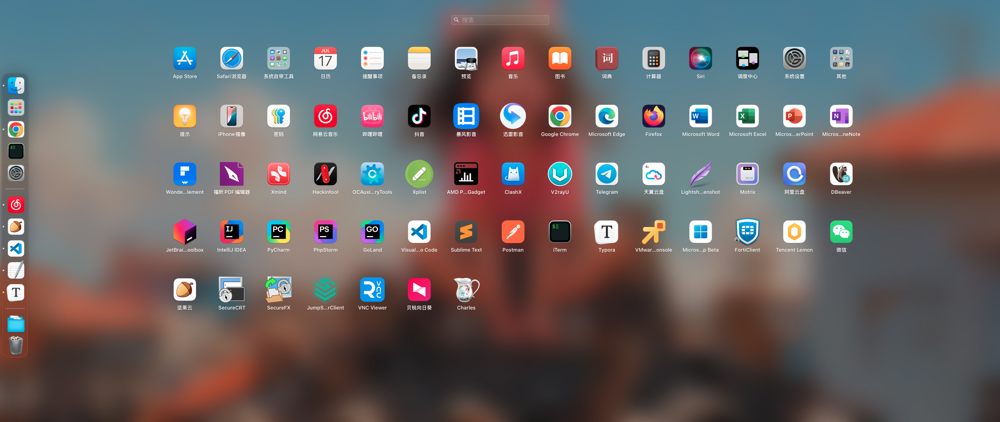

# 华硕TUF GAMING B550M-E Hackintosh

此版本EFI支持版本为：

- macOS Big Sur 11.x
- macOS Monterrey 12.x
- macOS Ventura 13.x
- macOS Sonoma 14.x
- macOS Sequoia 15.1.x

## 电脑配置信息/Computer configuration

|        主板        | 华硕 TUF GAMING B550M-E（LPC Controller B550芯片组） |
| :-------------------------: | :----------: |
|     CPU   | AMD Ryzen 7 5700X 8-Core 八核 |
|     内存     | 128 GB ( GLOWAY DDR4 3200MHz ) 4*32GB |
| 固态 | HP SSD FX900 Pro 2TB |
|   独立显卡  | AMD Radeon RX 570 Series ( 8 GB / 蓝宝石 ) |
|     网卡     | 瑞昱 RTL8168/8111/8112 |
| 声卡 | 瑞昱  @ AMD High Definition Audio 控制器 |
|     显示器   | 1080P |

## 配置注意事项

### 1.AMD补丁

需要更新实际情况进行AMD补丁的更新：https://github.com/AMD-OSX/AMD_Vanilla

### 2.AMD虚拟化

AMD黑苹果无法支持apple虚拟化功能，故无法正常使用虚拟化软件或容器化软件

一些是验证可以使用的虚拟化软件版本：

- virtualbox 6.1.50: Sonoma、Ventura、Monterrey、Big Sur系统环境下可正常使用
- ParallelsDesktop 13.0.1: Monterrey、Big Sur系统环境下可正常使用

## 配置修复的问题

1. 通过更新Apple ALC 1.9.3版本解决在macOS Sequoia 15.1.x环境下AMD声卡无法驱动的问题

